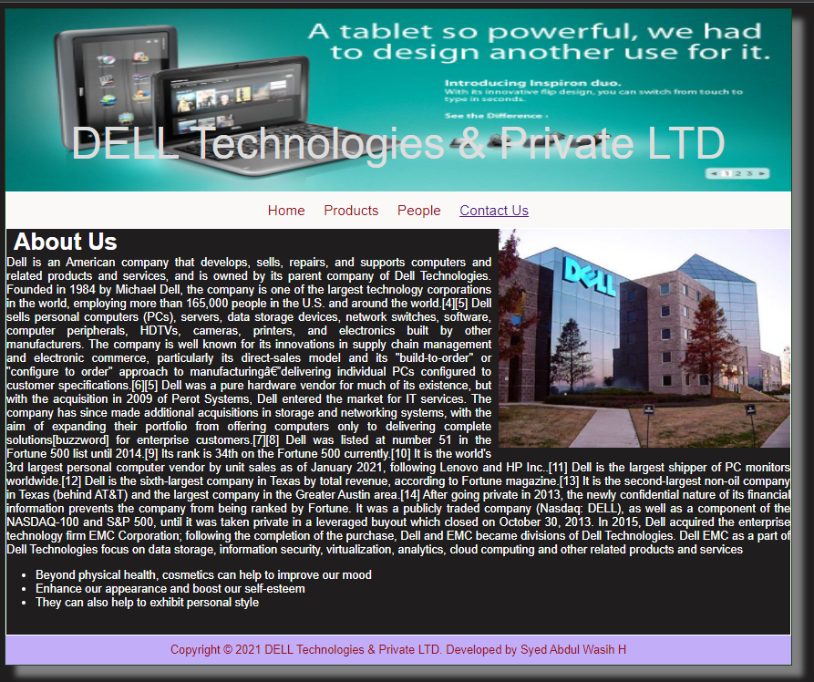
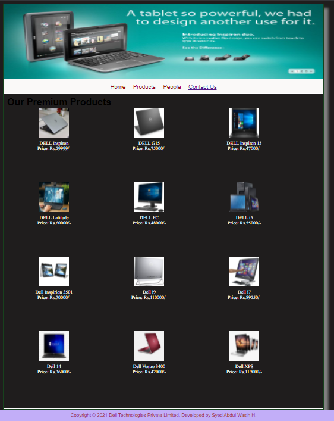
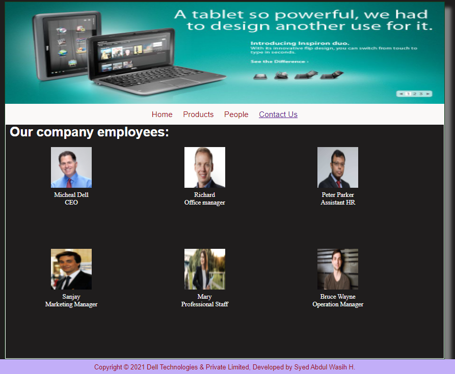
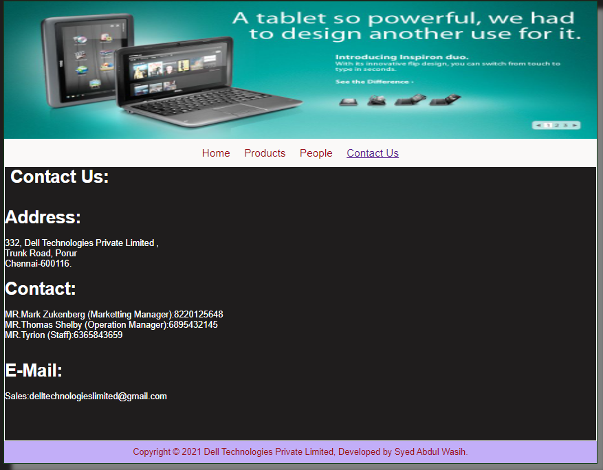

# Web Design for a Software Product Company

## AIM:

To design a static website for a software product company company.

## DESIGN STEPS:

### Step 1:

Requirement collection.

### Step 2:

Creating the layout using HTML and CSS.

### Step 3:

Updating the sample content.

### Step 4:

Choose the appropriate style and color scheme.

### Step 5:

Validate the layout in various browsers.

### Step 6:

Validate the HTML code.

### Step 6:

Publish the website in the given URL.

## PROGRAM :

### Layout.css :
~~~
* {
  box-sizing: border-box;
  font-family: Arial, Helvetica, sans-serif;
}
body {
  background-color: rgb(31, 29, 29);
  color: #17421d;
}
.container {
  width: 1080px;
  margin-left: auto;
  margin-right: auto;
  border-width: 1px 1px 1px 1px;
  border-style: solid;
  box-shadow: 15px 15px 8px gray;
}

.banner {
  display: block;
  width: 100%;
  height: 250px;
  text-align: center;
  font-size: 60px;
  background-image: url("/static/img/banner.jpg");
  background-size: 100% 100%;
  margin: 0px 0px 0px 0px;
  padding-top: 150px;
  color: #dcdddc;
}

.menu {
  display: block;
  width: 100%;
  height: 50px;
  font-size: larger;
  background-color: rgb(250, 249, 248);
  text-align: center;
  padding-top: 15px;
  margin: 0px 0px 0px 0px;
  border-width: 1px;
}

.menuitem {
  display: inline-block;
  margin-left: 10px;
  margin-right: 10px;
}
.menuitemselected {
  display: inline-block;
  margin-left: 10px;
  margin-right: 10px;
  color: #16d1ae;
}

.menuitem a {
  text-decoration: none;
  color: #9c1018;
}

.content {
  display: block;
  width: 100%;
  background-image: url("/static/img/QQQ2.jpg");
  min-height: 500px;
  background-size: 100% 100%;
  margin: 0px 0px 0px 0px;
  border-width: 1px;
  border-color: white;
  border-style: solid;
}
.homecontent {
  min-height: 500px;
  margin: 10px 10px 10px 10px;
  color: black;
  display: inline;
}
.homecontent h1 {
  color: white;
  display: inline;
  text-align: left;
}
.homecontent img {
  float: right;
  width: 400px;
  height: 300px;
  margin-left: 10px;
}

.contenttext {
  text-align: justify;
  color: rgb(255, 255, 255);
}

.productcontent {
  min-height: 500px;
  margin: 10px 10px 10px 10px;
}

.productcontent h1 {
  display: inline;
  color: black;
  text-align: left;
}

.productitems {
  display: block;
}

.productitem {
  display: inline-block;
  width: 30%;
  height: 250px;
  text-align: center;
}

.productitem img {
  width: 100px;
  height: 100px;
  display: inline-block;
}
.productitem .itemimage {
  display: inline-block;
  margin-left: auto;
  margin-right: auto;
  width: 100px;
  margin-bottom: 5px;
}

.productitem .itemname {
  display: block;
  color: rgb(253, 249, 249);
  font-family: block;
}
.productitem .itemprice {
  display: block;
  color: rgb(255, 255, 255);
  font-family: block;
}

.footer {
  display: block;
  width: 100%;
  height: 40px;
  background-color: rgb(194, 174, 248);
  text-align: center;
  padding-top: 10px;
  margin: 0px 0px 0px 0px;
  color: #9c1018;
}
~~~
### Home Page:
~~~
<!DOCTYPE html>
<html lang="en">
  <head>
    <title>DELL Technologies & Private LTD</title>
    <link rel="stylesheet" href="./css/layout.css" />
    <link rel="icon" href="./img/icon.png" type="image/x-icon" />
  </head>

  <body>
    

      
DELL Technologies & Private LTD

      

        
<a href="/static/home.html">Home</a>

        
<a href="/static/products.html">Products</a>

        
<a href="/static/people.html">People</a>

        
<a href="/static/contactus.html">Contact Us</a>

        

      

        

          <h1>About Us</h1>
          
          

            Dell is an American company that develops, sells, repairs, and supports computers and related products and services, and is owned by its parent company of Dell Technologies. Founded in 1984 by Michael Dell, the company is one of the largest technology corporations in the world, employing more than 165,000 people in the U.S. and around the world.[4][5]

Dell sells personal computers (PCs), servers, data storage devices, network switches, software, computer peripherals, HDTVs, cameras, printers, and electronics built by other manufacturers. The company is well known for its innovations in supply chain management and electronic commerce, particularly its direct-sales model and its "build-to-order" or "configure to order" approach to manufacturing—delivering individual PCs configured to customer specifications.[6][5] Dell was a pure hardware vendor for much of its existence, but with the acquisition in 2009 of Perot Systems, Dell entered the market for IT services. The company has since made additional acquisitions in storage and networking systems, with the aim of expanding their portfolio from offering computers only to delivering complete solutions[buzzword] for enterprise customers.[7][8]

Dell was listed at number 51 in the Fortune 500 list until 2014.[9] Its rank is 34th on the Fortune 500 currently.[10] It is the world's 3rd largest personal computer vendor by unit sales as of January 2021, following Lenovo and HP Inc..[11] Dell is the largest shipper of PC monitors worldwide.[12] Dell is the sixth-largest company in Texas by total revenue, according to Fortune magazine.[13] It is the second-largest non-oil company in Texas (behind AT&T) and the largest company in the Greater Austin area.[14] After going private in 2013, the newly confidential nature of its financial information prevents the company from being ranked by Fortune. It was a publicly traded company (Nasdaq: DELL), as well as a component of the NASDAQ-100 and S&P 500, until it was taken private in a leveraged buyout which closed on October 30, 2013.

In 2015, Dell acquired the enterprise technology firm EMC Corporation; following the completion of the purchase, Dell and EMC became divisions of Dell Technologies. Dell EMC as a part of Dell Technologies focus on data storage, information security, virtualization, analytics, cloud computing and other related products and services
            <ul>
              <li>Beyond physical health, cosmetics can help to improve our mood</li>
              <li>Enhance our appearance and boost our self-esteem</li>
              <li> They can also help to exhibit personal style </li>
            </ul>
          

        

      

      

        Copyright &#169; 2021  DELL Technologies & Private LTD. Developed by Syed Abdul Wasih H 
      

    

  </body>
</html>
~~~
### Product:
~~~
<!DOCTYPE html>
<html lang="en">
  <head>
    <title>Dell Technologies & Private Limited</title>
    <link rel="stylesheet" href="./css/layout.css" />
    <link rel="icon" href="./img/icon.png" type="image/x-icon" />
  </head>

  <body>
    

      

      

        
<a href="/static/home.html">Home</a>

        
<a href="/static/products.html">Products</a>

        
<a href="/static/people.html">People</a>

        
<a href="/static/contactus.html">Contact Us</a>

        

      

        
    
          <h1>Our Premium Products</h1>
          

              
 
                  

                  
                  

                  
DELL Inspiron

                  
Price: Rs.59999/- 

              

              
 
                  

                  
                  

                  
DELL G15 

                  
Price: Rs.75000/- 

              

              
 
                

                
                

                
DELL Inspiron 15

                
Price: Rs.47000/- 

              

              
 
                

                
                

                
DELL Latitude

                
Price: Rs.60000/- 

            

            
 
              

              
              

              
DELL PC

              
Price: Rs.48000/- 

          
  
 
            

            
            

            
DELL i5

            
Price: Rs.55000/- 

          
  
 
            

            
            

            
Dell Inspirion 3501

            
Price: Rs.70000/- 

          
  
 
            

            
            

            
Dell i9

            
Price: Rs.110000/- 

          
  
 
            

            
            

            
Dell i7

            
Price: Rs.89550/- 

        

      
  
 
        

        
        

        
Dell 14

        
Price: Rs.36000/- 

      
  
 
        

        
        

        
Dell Vostro 3400

        
Price: Rs.42000/- 

      
  
 
        

        
        

        
Dell XPS

        
Price: Rs.119000/- 

            

          

          
        
      

      

        Copyright &#169; 2021 Dell Technologies Private Limited, Developed by Syed Abdul Wasih H.
      

    

  </body>
</html>
~~~
### People:
~~~
<!DOCTYPE html>
<html lang="en">
  <head>
    <title>Dell Technologies & Private Limited</title>
    <link rel="stylesheet" href="./css/layout.css" />
    <link rel="icon" href="./img/ail.png" type="image/x-icon" />
    </head>
    <body>
    

      

      

        
<a href="/static/home.html">Home</a>

        
<a href="/static/products.html">Products</a>

        
<a href="/static/people.html">People</a>

        
<a href="/static/contactus.html">Contact Us</a>

        

      

        

          <h1>Our company employees:</h1>  
          

            
 
                

                
                

                
Micheal Dell

                
CEO

            

            
 
                

                
                

                
Richard

                
Office manager

            

            
 
              

              
              

              
Peter Parker

              
Assistant HR

            

            
 
              

              
              

              
Sanjay

              
Marketing Manager

          

          
 
            

            
            

            
Mary

            
Professional Staff

        
  
 
          

          
          

          
Bruce Wayne

          
Operation Manager

      

          

        

        
        
    

    

      Copyright &#169; 2021 Dell Technologies & Private Limited, Developed by Krishna Prakaash.
    

  

</body>
</html>
~~~
### Contact us:
~~~
<!DOCTYPE html>
<html lang="en">
  <head>
    <title>Dell Technologies & Private Limited</title>
    <link rel="stylesheet" href="./css/layout.css" />
    <link rel="icon" href="./img/ail.png" type="image/x-icon" />
  </head>

  <body>
    

      

      

        
<a href="/static/home.html">Home</a>

        
<a href="/static/products.html">Products</a>

        
<a href="/static/people.html">People</a>

        
<a href="/static/contactus.html">Contact Us</a>

      

      

        

          <h1>Contact Us:</h1>   
          <h1>Address:</h1>  
          

            332, Dell Technologies Private Limited , 
            Trunk Road, Porur 
            Chennai-600116. 
          
 
          <h1>Contact:</h1>  
          

              MR.Mark Zukenberg (Marketting Manager):8220125648 
              MR.Thomas Shelby (Operation Manager):6895432145 
              MR.Tyrion (Staff):6365843659   
          

          <h1>E-Mail:</h1>  
          

              Sales:delltechnologieslimited@gmail.com
          

        

      

      

        Copyright &#169; 2021  Dell Technologies Private Limited, Developed by Syed Abdul Wasih.
      

    

  </body>
</html>

~~~
## OUTPUT:

### Home Page:

### Product:

### People:

### Contact Us:

## Result:

Thus a website is designed for the software product company and the HTML,CSS code are validated.
